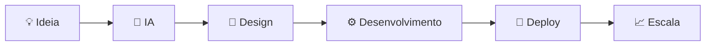

<div align="center">

# 🤖 AI PROJECTS HUB


<br>


</div>

---

<div align="center">

### 🌌 Onde a criatividade humana encontra a inteligência artificial

</div>

---

# 🚀 Sobre

Este repositório reúne projetos desenvolvidos com auxílio de Inteligência Artificial moderna.

Cada projeto foi construído utilizando IA para acelerar desenvolvimento, design, automação e inovação.

---

# ⚡ Tecnologias Utilizadas

<div align="center">


</div>

---

# 🧠 Projetos Desenvolvidos

## 🌐 Websites Inteligentes

```text
✓ Landing Pages
✓ Sites Corporativos
✓ Portais de Conteúdo
✓ Sistemas Administrativos
✓ Dashboards
✓ E-commerce
```

---

## 🤖 Inteligência Artificial

```text
✓ Chatbots
✓ Assistentes Virtuais
✓ Agentes de IA
✓ Automações
✓ Processamento de Linguagem Natural
✓ IA para Atendimento
```

---

## 📊 Sistemas Empresariais

```text
✓ CRM
✓ ERP
✓ Gestão Financeira
✓ Controle de Estoque
✓ Gestão de Equipes
✓ Relatórios Inteligentes
```

---

# 📈 Estatísticas

<div align="center">

| Métrica             | Resultado |
| ------------------- | --------- |
| 🚀 Projetos Criados | 150+      |
| 🤖 Agentes IA       | 80+       |
| 🌐 Websites         | 120+      |
| ⚡ Automações        | 300+      |
| ⭐ Satisfação        | 98%       |

</div>

---

# 🌟 Projetos em Destaque

### 🤖 AI Nexus

Plataforma de automação empresarial utilizando inteligência artificial.

---

### 🛒 Smart Commerce

Sistema de e-commerce inteligente com recomendações automáticas.

---

### 🎮 ModHub

Portal profissional para gerenciamento de mods de jogos.

---

### 📊 Vision Dashboard

Dashboard analítico alimentado por IA em tempo real.

---

# 🔥 Fluxo de Desenvolvimento



---

# 🏗️ Estrutura

```bash
AI-PROJECTS/
│
├── websites/
├── ai-agents/
├── automations/
├── dashboards/
├── mobile-apps/
├── backend/
│
├── docs/
├── assets/
│
└── README.md
```

---

# 🌍 Arquitetura Inteligente

```text
┌─────────────────────────────┐
│      USER INTERFACE         │
└─────────────┬───────────────┘
              │
              ▼
┌─────────────────────────────┐
│         API LAYER           │
└─────────────┬───────────────┘
              │
              ▼
┌─────────────────────────────┐
│      AI PROCESSING HUB      │
└─────────────┬───────────────┘
              │
      ┌───────┼────────┐
      ▼       ▼        ▼
 DATABASE   AGENTS   AUTOMATION
```

---

# 🎯 Objetivos

### ✅ Criar soluções inteligentes

### ✅ Automatizar processos

### ✅ Melhorar produtividade

### ✅ Escalar negócios

### ✅ Transformar ideias em produtos reais

---

# 🌌 Roadmap

```diff
+ Sistema de IA Avançado
+ Dashboard Inteligente
+ Marketplace de Agentes
+ Integrações Empresariais
+ Automações Complexas
+ Machine Learning
+ Analytics em Tempo Real
```

---

# 💎 Filosofia

> "A Inteligência Artificial não substitui a criatividade humana. Ela amplifica seu potencial."

---

<div align="center">


<br><br>


<br><br>


</div>

---

<div align="center">

# 🚀 Powered by Artificial Intelligence

### Construindo o futuro, um projeto por vez.


</div>
